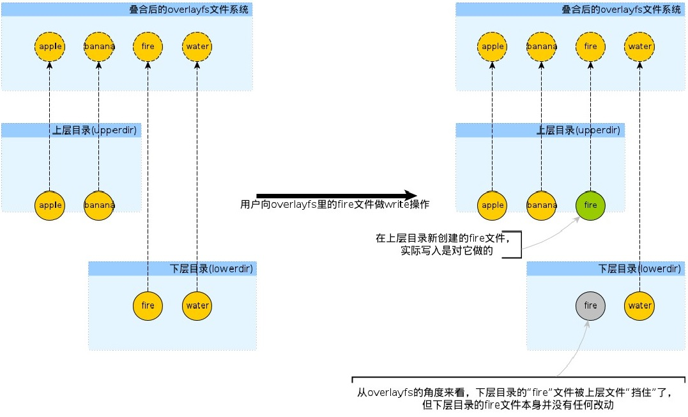
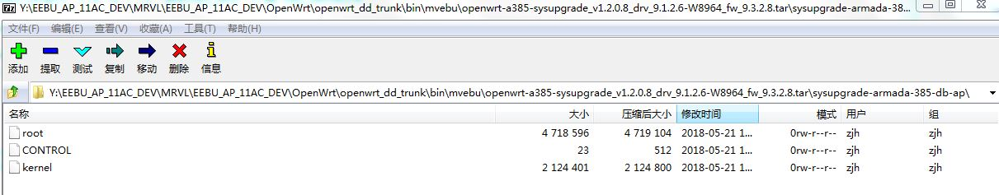
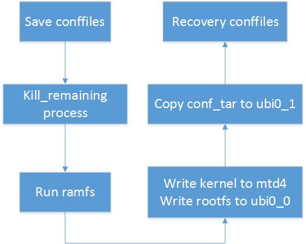

# OpenWrt Sysupgrade


### 1.1 简介
OpenWrt的GUI通过调用/sbin/upgrade来做系统升级，如果勾选保留配置则使用命令`/sbin/sysupgrade /tmp/xxx.img`，否则使用`/sbin/sysupgrade -n /tmp/xxx.img`。

同理，可以通过手动运行/sbin/sysupgrade来升级系统，首先将upgrade.img或者upgrade.tar上传到OpenWrt filesystem的/tmp/目录下，执行命令`/sbin/sysupgrade /tmp/upgrade.img`或者`/sbin/sysupgrade -n /tmp/upgrade.img`来做系统升级。

在编译OpenWrt过程中，会编程生成两个img，例如SC4平台则生成了如下两个img：
```
openwrt-a385-factory_v1.2.0.8_drv_9.1.2.6-W8964_fw_9.3.2.8.img
openwrt-a385-sysupgrade_v1.2.0.8_drv_9.1.2.6-W8964_fw_9.3.2.8.tar
```
即一个factory固件，一个sysupgrade固件，factory固件用于uboot升级，sysupgrade用于GUI升级，如果需要从原厂系统升级到OpenWrt系统，则需要使用factory固件，OpenWrt系统升级OpenWrt，则factory固件和sysupgrade固件都可以。

相对于sysupgrade固件，factory固件带数据分区和原厂预留分区，一般`sysupgrade.bin+空闲空间+系统的配置空间=factory.bin`的大小。

### 1.2 备份配置

使用命令`/sbin/sysupgrade -i -v /tmp/upgrade.tar`可以看到较为详细的sysupgrade流程。
在升级分区之前，可能需要先保留一些配置，例如mevbu平台会保留如下配置：
```
etc/config/agentlist
etc/config/dhcp
etc/config/dropbear
etc/config/easymesh
etc/config/firewall
etc/config/fstab
etc/config/luci
etc/config/network
etc/config/rpcd
etc/config/sysstat
etc/config/system
etc/config/ubootenv
etc/config/ucitrack
etc/config/uhttpd
etc/config/wireless
etc/config/wps
etc/crontabs/root
etc/dropbear/dropbear_rsa_host_key
etc/fw_env.config
etc/group
etc/hosts
etc/inittab
etc/luci-uploads/.placeholder
etc/opkg/keys/af22f7a88858c8e9
etc/opkg/keys/c5c3998ef01b3def
etc/passwd
etc/profile
etc/rc.local
etc/shadow
etc/shells
etc/sysctl.conf
etc/sysctl.d/local.conf
etc/sysstat/sysstat
```

那么哪些conffiles需要备份呢？查看/sbin/sysupgrade的do_save_conffiles函数实现如下：
```
do_save_conffiles() {
        local conf_tar="${1:-$CONF_TAR}"

        [ -z "$(rootfs_type)" ] && {
                echo "Cannot save config while running from ramdisk."
                ask_bool 0 "Abort" && exit
                return 0
        }
        run_hooks "$CONFFILES" $sysupgrade_init_conffiles
        ask_bool 0 "Edit config file list" && vi "$CONFFILES"

        v "Saving config files..."
        [ "$VERBOSE" -gt 1 ] && TAR_V="v" || TAR_V=""
        tar c${TAR_V}zf "$conf_tar" -T "$CONFFILES" 2>/dev/null

        rm -f "$CONFFILES"
}
```
`run_hooks "$CONFFILES" $sysupgrade_init_conffiles`实际是调用add_uci_conffiles函数：
```
add_uci_conffiles() {
        local file="$1"
        ( find $(sed -ne '/^[[:space:]]*$/d; /^#/d; p' \
                /etc/sysupgrade.conf /lib/upgrade/keep.d/* 2>/dev/null) \
                -type f -o -type l 2>/dev/null;
          opkg list-changed-conffiles ) | sort -u > "$file"
        return 0
}
```
从/etc/sysupgrade.conf、/lib/upgrade/keep.d/*、opkg list-changed-conffiles三种方式来决定那些conffiles需要得到备份，将需要备份的文件名保存到/tmp/sysupgrade.conffiles中，然后将这些文件打包生成一个tar包放在/tmp/sysupgrade.tgz。

如果需要修改哪些文件被备份，则修改/etc/sysupgrade.conf或者/lib/upgrade/keep.d/目录下的文件即可。

### 1.3 overlayfs

OpenWrt filesystem用到了overlayfs，overlayfs为叠合式文件系统，overlayfs分为三个目录upperdir、lowerdir和merged，所谓叠合式文件系统指的是upperdir会和lowerdir叠合，对外统一展示为merged，例如如下方式来挂载overlayfs,`mount -t overlay overlay -o lowerdir=/lower,upperdir=/upper,workdir=/work /merged`。
其中workdir必须和upperdir是mount在同一个文件系统下。

在overlayfs中，lowerfs是只读，所以对文件的修改只在upperfs中进行，其操作特点如下：
1. 如果upperfs和lowerfs有相同的文件，则上层覆盖下层，显示upperfs文件的内容。
2. 如果想要修改一个文件，该文件存在于upperfs，则修改upperfs中的文件，lowerfs中不定。
3. 如果想要修改一个文件，该文件只存在于lowerfs，而upperfs不存在该文件，则先将文件从lowerfs拷贝一份到upperfs，然后修改upperfs中的文件。

如下如所示：


在OpenWrt文件系统中，overlayfs的upperfs位于/overlay/upper/，lowerfs位于跟目录，例如修改了/lib/netifd/wireless/marvell.sh，则会在/overlay/upper/目录下创建一份/overlay/upper/lib/netifd/wireless/marvell.sh，将/overlay/upper/lib/netifd/wireless/marvell.sh删除即可将marvell.sh恢复到初始状态。

执行命令`firstboot -y`或者`jffs2reset -y`实际上就是将/overlay/upper/目录下的文件全部删除。

### 1.4 升级分区

在更新分区之后，升级系统的过程中需要先把存活的应用进程杀掉。
```
if [ ! -f /tmp/failsafe ] ; then
        kill_remaining TERM
        sleep 3
        kill_remaining KILL
fi
```
kill_remaining函数定义在/lib/upgrade/common.sh中，实际上是遍历/proc/$pid/stat，发送TERM和KILL来杀死进程，kill_remaining在杀进程中会避开kernel线程，init进程和基本的不能杀的进程，不能杀的进程有：`*procd*|*ash*|*init*|*watchdog*|*ssh*|*dropbear*|*telnet*|*login*|*hostapd*|*wpa_supplicant*|*nas*`。

在杀完不必要存活的应用程序之后，运行函数run_ramfs，将一个最小的能运行的系统mount到内存中运行，为后续的更新分区提供环境，此处的run_ramfs较为复杂，没有详细去分析。

在run_ramfs之后，就是do_upgrade来更新分区了。
如果定义了platform_do_upgrade则调用platform_do_upgrade。否则调用default_do_upgrade，SC4平台是有定义platform_do_upgrade的，定义在/lib/upgrade/platform.sh：
```
platform_do_upgrade() {
        local board=$(mvebu_board_name)

        case "$board" in
        armada-385-linksys-caiman|armada-385-linksys-cobra| \
            armada-385-linksys-rango|armada-385-linksys-shelby| \
            armada-xp-linksys-mamba|armada-385-db-ap)
                platform_do_upgrade_linksys "$ARGV"
                ;;
        *)
                default_do_upgrade "$ARGV"
                ;;
        esac
}
```
SC4平台的$board=armada-385-db-ap，使用platform_do_upgrade_linksys函数去升级分区，应该是开发的时候借用了Linksys的实现方式。

linksys升级分区的实现函数位于/lib/upgrade/linksys.sh：
```
platform_do_upgrade_linksys() {
        local magic_long="$(get_magic_long "$1")"

        local target_mtd=$(find_mtd_part $part_label)

        [ "$magic_long" = "73797375" ] && {
                CI_KERNPART="$part_label"
                if [ "$part_label" = "kernel1" ]
                then
                        CI_UBIPART="rootfs1"
                else
                        CI_UBIPART="rootfs2"
                fi

                nand_upgrade_tar "$1"
        }
        [ "$magic_long" = "27051956" ] && {
                ... ...
        }
}
```
linksys_get_target_firmware是通过命令`/usr/sbin/fw_printenv -n boot_part`来查看启动的kernel分区，是下命令去查看uboot的环境变量，启动的分区有两个，一个是kernel1，一个kernel2，一个是primary boot一个是alt boot，目前SC4平台启动用的是kernel1，即primary boot。

$magic_long表示img的长度，有两种长度：73797375和27051956，如果$magic_long==73797375则表示是通过tar来升级的，如果$magic_long==27051956则表示通过bin来升级，这两个长度是和linksys编译固件的时候Makefile定义一致的。

SC4是使用tar来做升级的，所以有`CI_UBIPART="rootfs1"`，且调用nand_upgrade_tar来处理tar包。
```
nand_upgrade_tar() {
        local tar_file="$1"
        local board_name="$(cat /tmp/sysinfo/board_name)"
        local kernel_mtd="$(find_mtd_index $CI_KERNPART)"

        local kernel_length=`(tar xf $tar_file sysupgrade-$board_name/kernel -O | wc -c) 2> /dev/null`
        local rootfs_length=`(tar xf $tar_file sysupgrade-$board_name/root -O | wc -c) 2> /dev/null`

        local rootfs_type="$(identify_tar "$tar_file" sysupgrade-$board_name/root)"

        local has_kernel=1
        local has_env=0

        [ "$kernel_length" != 0 -a -n "$kernel_mtd" ] && {
                tar xf $tar_file sysupgrade-$board_name/kernel -O | mtd write - $CI_KERNPART
        }
        [ "$kernel_length" = 0 -o ! -z "$kernel_mtd" ] && has_kernel=0

        nand_upgrade_prepare_ubi "$rootfs_length" "$rootfs_type" "$has_kernel" "$has_env"

        local ubidev="$( nand_find_ubi "$CI_UBIPART" )"
        [ "$has_kernel" = "1" ] && {
                local kern_ubivol="$(nand_find_volume $ubidev kernel)"
                tar xf $tar_file sysupgrade-$board_name/kernel -O | \
                        ubiupdatevol /dev/$kern_ubivol -s $kernel_length -
        }

        local root_ubivol="$(nand_find_volume $ubidev rootfs)"
        tar xf $tar_file sysupgrade-$board_name/root -O | \
                ubiupdatevol /dev/$root_ubivol -s $rootfs_length -

        nand_do_upgrade_success
}
```
其中$board_name等于"armada-385-db-ap", $CI_KERNPART等于"kernel1"，find_mtd_index是去/proc/mtd查找分区编号，SC4的filesystem有如下分区：
```
root@OpenWrt:/# cat /proc/mtd
dev:    size   erasesize  name
mtd0: 00500000 00040000 "u-boot"
mtd1: 00080000 00040000 "u_env"
mtd2: 00080000 00040000 "s_env"
mtd3: 00100000 00040000 "devinfo"
mtd4: 1fb00000 00040000 "kernel1"
mtd5: 1f300000 00040000 "rootfs1"
mtd6: 1fb00000 00040000 "kernel2"
mtd7: 1f300000 00040000 "ubi"
mtd8: 00300000 00040000 "unused_area"
mtd9: 01000000 00040000 "spi1.0"
```
kernel1对应的分区是mtd4，所以通过命令`tar xf $tar_file sysupgrade-$board_name/kernel -O | mtd write - kernel1`将kernel写到mtd4中。

tar包中有两个文件用来升级，kernel和root，如下图所示：


$kernel_length和$rootfs_length是读到的tar包中kernel和root两个文件的长度。

$CI_UBIPART等于rootfs1，$nand_find_ubi查找ubi分区，cat /sys/devices/virtual/ubi/ubi0/mtd_num等于5，rootfs1的mtd num也等于5，所以rootfs1分区对应于/sys/devices/virtual/ubi/ubi0/。

$nand_find_volume查找/sys/devices/virtual/ubi/ubi0/*/下面name等于rootfs的节点，
查到有：
```
root@OpenWrt:/# cat /sys/devices/virtual/ubi/ubi0/ubi0_0/name
rootfs
```
所以执行命令`ubiupdatevol /dev/ubi0_0 -s $rootfs_length`来升级rootfs volume。

综上：kernel存放在mtd分区，rootfs存放在ubi分区。

### 1.5 恢复配置

在升级分区之后，调用函数nand_do_upgrade_success：
```
nand_do_upgrade_success() {
        local conf_tar="/tmp/sysupgrade.tgz"

        sync
        [ -f "$conf_tar" ] && nand_restore_config "$conf_tar"
        echo "sysupgrade successful"
        reboot -f
}
```
nand_restore_config先挂载ubi分区rootfs_data volume，和找ubi分区rootfs一致，rootfs_data对应于ubi0_1。
`mount -t ubifs /dev/ubi0_1 /tmp/new_root`将rootfs_data挂载到/tmp/new_root，实际上/overlay/目录也是由ubi0_1挂载的，如下所示：
```
root@OpenWrt:/tmp/new_root# ls
upper  work
```

执行`firstboot -y`就是将/dev/ubi0_1重新挂载到overlay，从而删除原有的upperfs内容。
```
root@OpenWrt# firstboot -y
/dev/ubi0_1 is mounted as /overlay, only erasing files
```

所以相当于将之前备好的conf tar：/tmp/sysupgrade.tgz拷贝到/overlay/目录下。

升级完成之后，reboot系统，运行到/lib/preinit/80_mount_root时，将sysupgrade.tgz解压，从而恢复配置。
```
do_mount_root() {
        mount_root
        boot_run_hook preinit_mount_root
        [ -f /sysupgrade.tgz ] && {
                echo "- config restore -"
                cd /
                tar xzf /sysupgrade.tgz
        }
}
```

### 1.6 总结

以下图来总结上述的sysupgrade流程：
