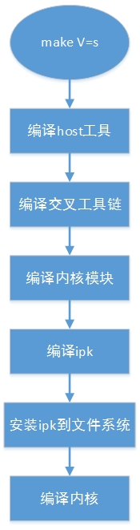
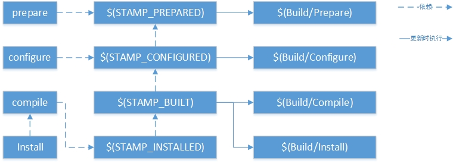
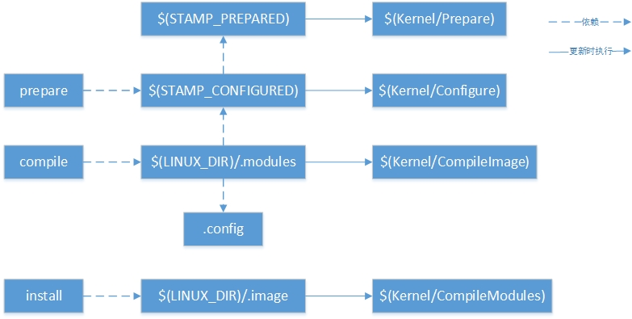

# OpenWrt学习总结
Jinhua Zhang
Version 1.0
2017.8.5
<br>

## 1 编译环境搭建

由于还没有访问P4的权限，所以先按官网上的方式学习搭建OpenWrt的编译环境。marvell内部版本的OpenWrt的编译环境与此大部分步骤相同，具体可参考marvell OpenWrt首目录下面的readme.txt文件。

### 1.1 安装工具

在下载OpenWrt源码前，需要在Ubuntu系统中安装一系列工具，这些工具主要用于OpenWrt版本管理，解压tar包，编译，打包img等，按如下步骤来安装工具：
```
sudo apt-get install g++
sudo apt-get install libncurses5-dev
sudo apt-get install zlib1g-dev
sudo apt-get install bison
sudo apt-get install flex
sudo apt-get install unzip
sudo apt-get install autoconf
sudo apt-get install gawk
sudo apt-get install make
sudo apt-get install gettext
sudo apt-get install gcc
sudo apt-get install binutils
sudo apt-get install patch
sudo apt-get install bzip2
sudo apt-get install libz-dev
sudo apt-get install asciidoc
sudo apt-get install subversion
sudo apt-get install sphinxsearch
sudo apt-get install libtool
sudo apt-get install sphinx-common
```

### 1.2 下载SourceCode

官网给出的OpenWrt源码下载方式是：
> git clone git://github.com/openwrt/openwrt.git

如果从git://github.com/openwrt/openwrt.git这个链接上无法下载，可以改成下面的链接试试：
> git clone https://github.com/openwrt/openwrt.git

最新的稳定版分支是chao_calmer，建议切换到稳定分支，使用下面的命令切换：
> git checkout -b chao_calmer origin/chao_calmer

注意：从官网上下载下来的OpenWrt源码和marvell内部的OpenWrt源码存在差异，所以官网下载下来的源码仅供学习使用，下面都是基于官网上下载的OpenWrt源码来做的分析，版本是chao_calmer.


### 1.3 编译前准备工作

在编译OpenWrt之前，需要通过feeds来下载软件套件，主要有：Luci，packages，management，routing，telephone等。OpenWrt提供了一个脚本来做这些软件套件的下载和配置工作，使用下面两个命令完成：
> ./scripts/feeds update -a
> ./scripts/feeds install -a

update会将软件套件下载feeds目录下面，install会将feeds的内容创建软链接到package/feeds。

执行命令：
> make menuconfig

选择Target System为"Marvell Armada 37x/38x/XP"，选择Target Profile为"Marvell Armada 385 DB AP (DB-88F6820-AP)"，配置选择编译Luci或者其他packages。

menuconfig目标定义在include/toplevel.mk中；
```
menuconfig: scripts/config/mconf prepare-tmpinfo FORCE
        if [ \! -e .config -a -e $(HOME)/.openwrt/defconfig ]; then \
                cp $(HOME)/.openwrt/defconfig .config; \
        fi
        $< Config.in
```
如果没有找到.config，则将defconfig拷贝到.config。实际上defconfig也是不存在的，所以通过命令scripts/config/mconfig Config.in来生成.config，首目录下面的Config.in会include子目录下面的Config.in。

执行命令：
> make kernel_menuconfig

配置kernel的menuconfig，与配置标准的linux menuconfig一样，kernel_menuconfig也是定义在include/toplevel.mk。
```
kernel_menuconfig: prepare_kernel_conf
        $(_SINGLE)$(NO_TRACE_MAKE) -C target/linux menuconfig
```
make kernel_menuconfig实际上是进到target/linux目录下执行menuconfig。
target/linux/Makefile的menuconfig目标实际上是进到$(BOARD)目录下执行menuconfig，所以最终是执行了target/linux/mvebu/Makefile的menuconfig目标。
kernel的menuconfig目标定义在kernel-build.mk中，规则定义如下：
```
oldconfig menuconfig nconfig: $(STAMP_PREPARED) $(STAMP_CHECKED) FORCE
        rm -f $(LINUX_DIR)/.config.prev
        rm -f $(STAMP_CONFIGURED)
        $(LINUX_RECONF_CMD) > $(LINUX_DIR)/.config
        $(_SINGLE)$(MAKE) -C $(LINUX_DIR) $(KERNEL_MAKEOPTS) $$@
        $(LINUX_RECONF_DIFF) $(LINUX_DIR)/.config > $(LINUX_RECONFIG_TARGET)
```
实际上做了三件事，1、生成$(LINUX_DIT)/.config，2、进到$(LINUX_DIR)目录执行menuconfig，3、如果.config有修改则保存到$(LINUX_RECONFIG_TARGET)；
1. 生成$(LINUX_DIT)/.config
$(LINUX_RECONF_CMD)定义在include/target.mk中。

```
LINUX_RECONF_CMD = $(call __linux_confcmd,$(LINUX_RECONFIG_LIST),)
__linux_confcmd = $(SCRIPT_DIR)/kconfig.pl $(2) $(patsubst %,+,$(wordlist 2,9999,$(1))) $(1)
LINUX_RECONFIG_LIST = $(wildcard $(GENERIC_LINUX_CONFIG) \
$(LINUX_TARGET_CONFIG) $(if $(USE_SUBTARGET_CONFIG),$(LINUX_SUBTARGET_CONFIG)))
```

__linux_confcmd就是调用了kconfig.pl脚本，LINUX_RECONFIG_LIST包含了两个文件，一个是target/linux/generic/config-3.18，另一个是target/linux/mvebu/config.3.18。也就使用脚本kconfig.pl来生成.config。
2. 进到$(LINUX_DIR)目录执行menuconfig
这步和普通的linux目录下执行make menuconfig是一样的。
3. 如果.config有修改则保存到$(LINUX_RECONFIG_TARGET)
$(LINUX_RECONF_DIFF)也是kconfig.pl脚本，$(LINUX_RECONFIG_TARGET)是target/linux/mvebu/config.3.18，也就是说如果.config有修改，则会保存到target/linux/mvebu/config.3.18上。

### 1.4 整体编译

执行make V=s进行整体编译，第一次编译建议使用make V=s，可以看到详细的编译过程以及出错信息，如果想要加快编译速度，可以添加参数-j n，表示使用n条线程同时编译。
整体编译分成下面几个步骤，包括编译host工具、编译交叉工具链、编译内核模块、编译ipk、安装ipk到文件系统、编译内核、将内核和文件系统组合成最终的bin文件。

<center></center>

make clean清除$(BUILD_DIR)、$(STAGING_DIR)、$(BIN_DIR)和$(BUILD_LOG_DIR)；
make dirclean清除$(STAGING_DIR_HOST)、$(TOOLCHAIN_DIR)、$(BUILD_DIR_HOST)、$(BUILD_DIR_TOOLCHAIN)和$(TMP_DIR);
make distclean清除所有相关目录，包括下载的软件包，配置文件，feed内容等，包括bin、build_dir、.config\*、dl、feeds、key-build\*、logs、packages/feeds、package/openwrt-packages、staging_dir和tmp目录。

## 2 目录结构

```
 openwrt
 ├─ docs
 ├─ toolchain
 ├─ config
 ├─ package
 |  ├─ firmware
 |  ├─ network
 |  ├─ utils
 |  ├─ boot
 |  ├─ kernel
 |  ├─ system
 |  ├─ feeds
 ├─ scripts
 ├─ tools
 ├─ include
 ├─ target
 |  ├─ linux
 |  ├─ sdk
 |  ├─ toolchain
 ├─ feeds
 ├─ dl
 ├─ staging_dir
 |  ├─ host
 |  ├─ target-arm-cortex-a9+vfpv3_uClibc-0.9.33.2_eabi
 |  ├─ toolchain-arm_cortex-a9+vfpv3_gcc-linaro_uClibc-0.9.33.2_eabi
 ├─ build_dir
 |  ├─ host
 |  ├─ target-arm_cortex-a9+vfpv9_uClibc-0.9.33.2_eabi
 |  ├─ toolchain-arm_cortex-a9+vfpv9_gcc-4.8-linaro_uClibc-0.9.33.2_eabi
 ├─ bin
 |  ├─ mvebu
```

OpenWrt初始目录包括docs，toolchain，config，package，scripts，tools，include，target。
- toolchain
  包含一些命令去获取kernel headers，c library，bin-utils，debugger。
- package
  包含针对各个软件包的Makefile。OpenWrt定义了一套Makefile模板，各软件参照这个模板定义自己的信息，如软件包的版本、下载地址、编译方式、安装地址等。
- script
  一些perl脚本，用于软件包管理
- tools
  编译时需要一些工具，tools里包含了获取和编译这些工具的命令。里面有一些Makefile，有的可能还有patch。每个Makefile里有一句$(eval $(call HostBuild))，表示编译这个工具是为了在主机上使用的。
- include
  OpenWrt的Makefile都存放在这里。
- target
  各平台在这个目录定义了firmware和kernel的编译过程。

编译生成的文件夹有feeds，dl，staging_dir，build_dir，bin
- feeds
  通过feeds下载的软件套件。
- dl
  软件包下载后放在这个目录里
- staging_dir
  最终安装目录。tools，toolchain被安装在这里，roots也安装在这里。
- build_dir
  软件包都解压在build_dir里，然后在此编译
- bin
  编译完成之后，firmware和各种ipk会放在此目录下。

## 3 编译系统

首目录下面的Makefile的第一个目标是world，所以make时默认是执行目标world，但是world的依赖和命令都是空的，说明Makefile后面会覆盖该条规则；
第一次进入Makefile时OPENWRT_BUILD=0，第二次进入Makefile时OPENWRT_BUILD=1，第一次进入时include toplevel.mk，toplevel.mk中的%::解释了world目标的规则：
```
%::
    @+$(PREP_MK) $(NO_TRACE_MAKE) -r -s prereq
    @( \
        cp .config tmp/.config; \
        ./scripts/config/conf --defconfig=tmp/.config -w tmp/.config Config.in > /dev/null 2>&1; \
            if ./scripts/kconfig.pl '>' .config tmp/.config | grep -q CONFIG; then \
                printf "$(_R)WARNING: your configuration is out of sync. \
                    Please run make menuconfig, oldconfig or defconfig!$(_N)\n" >&2; \
            fi \
    )
    @+$(ULIMIT_FIX) $(SUBMAKE) -r $@ $(if $(WARN_PARALLEL_ERROR), || { \
        printf "$(_R)Build failed - please re-run with -j1 to see the real error message$(_N)\n" >&2; \
        false; \
    } )
```
相当于：
```
%::
    @make V=s -r -s prereq
    @make -w -r world
```
也就是会再进到首目录下面执行make world；
第二次make时，OPENWRT_BUILD=1，进入else分支，会include一些Makefile，包括：rules.mk、$(INCLUDE_DIR)/depends.mk、$(INCLUDE_DIR)/subdir.mk、target/Makefile、package/Makefile、tools/Makefile、toolchain/Makefile。

其中rules.mk中会定义一些全局宏，这些宏主要是定义了Makefile会用到的目录路径，且宏的值于target system和target profile有关，针对Target System为"Marvell Armada 37x/38x/XP"，Target Profile为"Marvell Armada 385 DB AP (DB-88F6820-AP)"，宏定于值如下：
- BUILD_DIR
  build_dir/target-arm_cortex-a9+vfpv3_musl-1.1.16_eabi
- STAGING_DIR
  staging_dir/target-arm_cortex-a9+vfpv3_musl-1.1.16_eabi
- BIN_DIR
  bin/mvebu
- BUILD_LOG_DIR
  logs
- STAGING_DIR_HOST
  staging_dir/host
- TOOLCHAIN_DIR
  staging_dir/toolchain-arm_cortex-a9+vfpv3_gcc-5.3.0_musl-1.1.16_eabi
- BUILD_DIR_HOST
  build_dir/host
- BUILD_DIR_TOOLCHAIN
  build_dir/toolchain-arm_cortex-a9+vfpv3_gcc-5.3.0_musl-1.1.16_eabi
- PACKAGE_DIR
  bin/mvebu/packages
- TARGET_ROOTFS_DIR
  build_dir/target-arm_cortex-a9+vfpv3_musl-1.1.16_eabi
- TARGET_DIR
  build_dir/target-arm_cortex-a9+vfpv3_musl-1.1.16_eabi/root-mvebu
- STAGING_DIR_ROOT
  staging_dir/target-arm_cortex-a9+vfpv3_musl-1.1.16_eabi/root-mvebu

$(INCLUDE_DIR)/subdir.mk定义了两个非常重要的函数：subdir和stampfile，subdir会生成一些规则，例如package/Makefile调用了(eval $(call subdir,$(curdir)))，则会递归到各个子目录下，生成package/$(bd)/$(target)和package/$(lastdir)/$(target)，$(target)取值为clean download prepare compile install update refresh prereq dist distcheck configure。
以iperf为例，subdir会为其生成下面规则：
> D package
> BD package/network/utils/iperf
> package/network/utils/iperf/clean: package/stamp-install/clean
> package/iperf/clean: package/network/utils/iperf/clean
> package/network/utils/iperf/download:
> package/iperf/download: package/network/utils/iperf/download
> package/network/utils/prepare:
> package/iperf/prepare: package/network/utils/prepare
> package/network/utils/iperf/compile: package/libs/toolchain/compile package/libs/uClibc++/compile
> package/iperf/compile: package/network/utils/iperf/compile
> package/network/utils/iperf/install:
> package/iperf/install: package/network/utils/iperf/install
> package/network/utils/iperf/update:
> package/iperf/update: package/network/utils/iperf/update
> package/network/utils/iperf/refresh:
> package/iperf/refresh: package/network/utils/iperf/refresh
> package/network/utils/iperf/prereq:
> package/iperf/prereq: package/netowrk/utils/iperf/prereq

package/network/utils/iperf/compile这条规则的命令是make -C network/utils/iperf compile，也就是规则如下：
```
package/network/utils/iperf/compile: \
        package/libs/toolchain/compile \
        package/libs/uClibc++/compile
	make -C network/utils/iperf compile
```
同样，其他目标也是同样的规则，所以如果需要单独编译iperf，则执行命令make package/network/utils/iperf/compile或者make package/iperf/compile；
同样，单独编译内核则执行命令make target/linux/compile；
单独编译内核模块，例如mwlwifi，则执行命令make package/kernel/mwlwifi/compile。

stampfile同样会生成一些规则，这些规则主要用于生成记录编译时间的中间文件，用于解决依赖关系，以及哪些目标需要重新被执行；

### 3.1 编译packages

以iperf为例进行说明，iperf的Makefile位于package/network/utils/iperf目录下，包括如下文件：
```
package/network/utils/iperf
├─ Makefile
├─ patches
   ├─ 0001-set-report-next-time-in-single-thread-mode.patch
```
执行命令
> make package/iperf/compile

或者
> make package/network/utils/iperf/compile

Makefile的内容如下：
```
include $(TOPDIR)/rules.mk

PKG_NAME:=iperf
PKG_VERSION:=2.0.5
PKG_RELEASE:=1

PKG_BUILD_DIR:=$(BUILD_DIR)/$(PKG_NAME)-$(BUILD_VARIANT)/$(PKG_NAME)-$(PKG_VERSION)
PKG_SOURCE:=$(PKG_NAME)-$(PKG_VERSION).tar.gz
PKG_SOURCE_URL:=@SF/$(PKG_NAME)
PKG_MD5SUM:=44b5536b67719f4250faed632a3cd016

PKG_MAINTAINER:=Felix Fietkau <nbd@openwrt.org>
PKG_LICENSE:=BSD-3-Clause

PKG_BUILD_PARALLEL:=1

include $(INCLUDE_DIR)/uclibc++.mk
include $(INCLUDE_DIR)/package.mk

define Package/iperf/Default
  SECTION:=net
  CATEGORY:=Network
  DEPENDS:= $(CXX_DEPENDS)
  TITLE:=Internet Protocol bandwidth measuring tool
  URL:=http://sourceforge.net/projects/iperf/
endef

define Package/iperf/Default/description
 Iperf is a modern alternative for measuring TCP and UDP bandwidth
 performance, allowing the tuning of various parameters and
 characteristics.
endef

define Package/iperf
$(call Package/iperf/Default)
  TITLE+= (with single thread support)
  VARIANT:=single
endef

define Package/iperf/description
$(call Package/iperf/Default/description)
 This package is built with single thread support.
endef

CONFIGURE_ARGS += --disable-multicast
CONFIGURE_VARS += ac_cv_func_malloc_0_nonnull=yes

ifeq ($(BUILD_VARIANT),single)
  CONFIGURE_ARGS += --disable-threads
else
  CONFIGURE_ARGS += --enable-threads=posix
  CONFIGURE_VARS += ac_cv_func_pthread_cancel=no
endif

CONFIGURE_VARS += CXXFLAGS="$$$$CXXFLAGS -fno-rtti"

define Package/iperf/install
	$(INSTALL_DIR) $(1)/usr/bin
	$(INSTALL_BIN) $(PKG_BUILD_DIR)/src/iperf $(1)/usr/bin/iperf
endef

$(eval $(call BuildPackage,iperf))
```

Makefile中首先定义了一些变量，包括：
- PKG_NAME
  package的名字，用于显示在menuconfig和生成ipkg，例中该值等于iperf
- PKG_VERSION
  package的版本号，例中该值等于2.0.5
- PKG_RELEASE
  package的Makefile的版本，例中该值等于1
- PKG_SOURCE
  package的sourcecode包的名称，例中该值等于iperf-2.0.5.tar.gz
- PKG_SOURCE_URL
  package sourcecode包的下载链接，可以添加多个链接，以分号隔开，例中该值等于@SF/iperf，其中@SF表示从sourceforge
- PKG_MD5SUM
  tar包的MD5校验码，由于核对tar包下载是否正确
- PKG_CAT
  tar包的解压方式，包括zcat, bzcat, unzip等
- PKG_BUILD_DIR
  tar包解压以及编译的路径，如果Makefile中不指定，则默认为$(BUILD_DIR)/$(PKG_NAME)$(PKG_VERSION)，例子中将PKG_BUILD_DIR指定成了$(BUILD)/iperf-single/iperf-2.0.5

PKG_*这些变量主要描述了package的从什么连接下载，下载什么版本的tar包，以及如何解压tar包。

此外还定义了下面这些宏:
**Package/$(PKG_NAME):**
$(PKG_NAME)表示package的名称，在Package/$(PKG_NAME)中同样会定义下面这些变量：
- SECTION
  package类别（这个变量并不使用）
- CATEGORY
  package在menuconfig上面显示的分类，包括Network, Sound, Utilities, Multimedia等
- TITLE
  package的简单描述
- URL
  package sourcecode的下载链接
- MAINTAINER (可选)
  package作者或联系人
- DEPENDS (可选)
  依赖其他模块，例如

**Package/$(PKG_NAME)/conffiles (可选):**
该package所需要的config文件，每行列举一个；
例如ppp模块需要的config定义在Makefile。
```
defind Package/ppp/conffiles
/etc/ppp/chap-secrets
/etc/ppp/filter
/etc/ppp/ip-down
/etc/ppp/ip-up
/etc/ppp/option
ended
```

**Build/Prepare (可选):**
定义一些列解压缩tar包，打patch，拷贝sourcecode到build dir等操作的命令

**Build/Compile (可选):**
定义编译的命令

**Package/$(PKG_NAME)/install:**
将编译之后的bin拷贝到对应的目录下面去，一般定义下面四个宏来完成拷贝动作
- INSTALL_DIR：install -d m0755
- INSTALL_BIN：install -m0755
- INSTALL_DATA：install -m0644
- INSTALL_CONF：install -m0600

所以例子中的
```
define Package/iperf/install
	$(INSTALL_DIR) $(1)/usr/bin
	$(INSTALL_BIN) $(PKG_BUILD_DIR)/src/iperf $(1)/usr/bin/iperf
endef
```
相当于执行了下面两个命令：
```
install -d m0755 $(KDIR)/usr/bin #如果不存在则新建$(KDIR)/usr/bin文件夹
install -m0755 $(PKG_BUILD_DIR)/src/iperf $(KDIR)/usr/bin/iperf
#将bin文件iperf从编译目录拷贝到$(KDIR)/usr/bin文件夹中
```

最后一句$(eval $(call BuildPackage,iperf))是关键，BuildPackage定义在include/package.mk中，代码如下：

```
define BuildPackage
  $(Build/IncludeOverlay)
  $(eval $(Package/Default))
  $(eval $(Package/$(1)))

...

  $(if $(PKG_HOST_ONLY)$(DUMP),,$(call Build/DefaultTargets,$(1)))
endef
```
$(Build/IncludeOverlay)会include$(TOPDIR)/overlay/*/$(PKG_DIR_NAME).mk，如果有该mk文件则overlay掉初始Makfile中的一些定义，一般下载后的package不方便直接修改，可以通过overlay的方式修改编译选项。
$(eval $(Package/Default))展开package中default值。
$(eval $(Package/$(1)))展开package Makefile中定义的值。

分析package.mk发现，目标install依赖于compile，compile依赖于$(STAMP_INSTALLED)，$(STAMP_INSTALLED)依赖于$(STAMP_BUILT)，$(STAMP_BUILT)依赖于$(STAMP_CONFIGURED)，$(STAMP_CONFIGURED)依赖于$(STAMP_PREPARED)，其中$(STAMP_PREPARED)更新是会执行$(Build/Prepare)，$(STAMP_CONFIGURED)更新时会执行$(Build/Configure)，$(STAMP_BUILT)更新时会执行$(Build/Compile)和$(Build/Install)。

目标configure依赖于$(STAMP_CONFIGURED)。
目标prepare依赖于$(STAMP_PREPARED)。

<center></center>

如果在package Makefile中没有定义，那么这些宏的默认值为：

```
Build/Prepare=$(call Build/Prepare/Default,)
Build/Configure=$(call Build/Configure/Default,)
Build/Compile=$(call Build/Compile/Default,)
Build/Install=$(if $(PKG_INSTALL),$(call Build/Install/Default,))
Build/Dist=$(call Build/Dist/Default,)
Build/DistCheck=$(call Build/DistCheck/Default,)
```

先看看Build/Compile/Default，定义在include/package-defaults.mk中；

```
define Build/Compile/Default
	+$(MAKE_VARS) \
	$(MAKE) $(PKG_JOBS) -C $(PKG_BUILD_DIR)/$(MAKE_PATH) \
		$(MAKE_FLAGS) \
		$(1);
endef
```

相当于进到build_dir目录下面执行make iperf，即去执行source code的Makefile。
Build/Prepare/Default会执行$(PKG_UNPACK)和$(Build/Patch)，即解压tar包和打patch。

### 3.2 编译kernel

编译kernel使用命令make target/linux/compile，会进到BOARD目录下去make，对于Target System为"Marvell Armada 37x/38x/XP"，Target Profile为"Marvell Armada 385 DB AP (DB-88F6820-AP)"时，$(BOADR)等于mvebu；
target/linux/mvebu中的Makefile很简单：
```
include $(TOPDIR)/rules.mk

ARCH:=arm
BOARD:=mvenu
BOARDNAME:=Marvell Armda 37x/38x/XP
FEATURES:=usb pci pcie gpio nand squashfs
CPU_TYPE:=contex-a9
MAINTAINER:=Imre Kaloz <kaloz@openwrt.org>

KERNEL_PATCHVER：=3.18

include $(INCLUDE_DIR)/target.mk

KERNELNAME:=zImage dtbs

DEFAULT_PACKAGES += uboot-envtools

$(eval $(call BuildTarget))
```
在package/linux/Makefile定义了TARGET_BUILD=1，所以BuildTarget等于$(BuildKernel)，BuidKernel定义在kernel-build.mk中，kernel-build.mk中的compile目标规则定义如下：
```
  compile: $(LINUX_DIR)/.modules
        $(MAKE) -C image compile TARGET_BUILD=
```
编译kernel时目标compile依赖于$(LINUX_DIR)/.modules，install依赖于$(LINUX_DIR)/.image，prepare依赖于$(STAMP_CONFIGURED)，$(LINUX_DIR)/.modules依赖于$(STAMP_CONFIGURED)和.config，$(LINUX_DIR)/.imag依赖于$(STAMP_CONFIGURED)；

在更新 $(LINUX_DIR)/.modules时执行命令$(Kernel/CompileModules)，更新 $(LINUX_DIR)/.image时执行命令 $(Kernel/CompileImage)，更新命令$(STAMP_CONFIGURED)是执行命令命令$(Kernel/Configure)，更新$(STAMP_PREPARED)时执行命令$(Kernel/Prepare)；

<center></center>

默认情况下，Kernel/CompileImage=Kernel/CompileImage/Default、kernel/CompileModules=kernel/CompileModules/Default、Kernel/Configure=Kernel/Configure/Default、Kernel/Prepare=Kernel/Prepare/Default。
Kernel/CompileImage/Default、kernel/CompileModules/Default、Kernel/Configure/Default、Kernel/Prepare/Default定义在kernel-default.mk中；
- Kernel/Prepare/Default
  执行命令：
  xzcat $(DL_DIR)/$(LINUX_SOURCE) | $(TAR) -C $(KERNEL_BUILD_DIR)$(TAR_OPTIONS)
  $(Kernel/Patch)
  即是解压和打patch
- Kernel/Configure/Default
  配置.config
- kernel/CompileModules/Default
  执行命令：
  $(MAKE) $(KERNEL_MAKEOPTS) modules
  即是进到build_dir下面的linux source code目录下执行make modules
- Kernel/CompileImage/Default
  执行命令：
  $(MAKE) $(KERNEL_MAKEOPTS) $(if $(KERNELNAME),$(KERNELNAME),all) modules
  即是进到build_dir里面的linux source code目录执行make all modules

### 3.3 编译kernel modules

kernel modules表示外部驱动模块，位于package/kernel目录下，例如mwlwifi就在package/kernel/mwlwifi下面；
看到Makefile和package的区别是最后一句
```
$(eval $(call KernelPackage,mwlwifi-pcie))
```
KernelPackage定义在kernel.mk中：
```
$$(eval $$(call BuildPackage,kmod-$(1)))
```
最终编译kernel modules和编译package的方式是一样的；
单独编译mwlwifi的命令是make package/kernel/mwlwifi/compile或者make package/mwlwifi/compile

## 4 添加模块

### 4.1 添加APP模块

向OpenWrt中添加一个自己的APP的模块，模块的功能很简单，仅仅是打印一句"Hello World"，在package/utils中新建一个helloworld的文件夹，在helloworld文件夹中新建Makefile和src文件夹，src用于存放helloworld的源文件和helloworld bin的Makefile文件。
helloworld目录下的Makefile内容如下：

```
include $(TOPDIR)/rules.mk

PKG_NAME:=helloworld
PKG_RELEASE:=1

PKG_BUILD_DIR:=$(BUILD_DIR)/$(PKG_NAME)

include $(INCLUDE_DIR)/package.mk

define Package/helloworld
  SECTION:=utils
  CATEGORY:=Utilities
  TITLE:=Print Hello World
endef

define Build/Prepare
	mkdir -p $(PKG_BUILD_DIR)
	$(CP) -R ./src/* $(PKG_BUILD_DIR)
endef

define Package/helloworld/install
	$(INSTALL_DIR) $(1)/usr/sbin
	$(INSTALL_BIN) $(PKG_BUILD_DIR)/helloworld $(1)/usr/sbin
endef

$(eval $(call BuildPackage,helloworld))
```

相关的宏定义如下
- PKG_NAME：
  等于helloworld
- PKG_RELEASE
  Makefile的版本号为1
- PKG_BUILD_DIR
  编译路径，此处实际上和默认的路径名是一样的，所以可以不定义
- Package/helloworld
  设置CATEGORY:=Utilities，TITLE:=Print Hello World，在menuconfig中helloworld在Utilities项下面可以找到；
- Build/Prepare
  将package/utils/helloworld/src/目录下面的源代码拷贝到build_dir对于的目录下，编译会进到build_dir下面的helloworld目录下。
- Package/helloworld/install
  将编译生成的bin文件拷贝到root-mvebu/usr/sbin/目标下，最终会被打包到rootfs中去。

helloworld.c和编译helloworld的Makefile需要编写放在package/utils/helloworld/src/下面，最终执行make package/helloworld/compile即可以编译。

### 4.2 添加驱动模块

同样，添加一个简单的helloworld驱动程序，驱动的功能仅仅是打印"Hello World"。在package/kernel/目录下新建helloworld目录，在helloworld目录下新建Makefile和src，src用于存放驱动的Makefile和源文件。

helloworld目录下面的Makefile内容如下：
```
include $(TOPDIR)/rules.mk
include $(INCLUDE_DIR)/kernel.mk

PKG_NAME:=helloworld
PKG_RELEASE:=1

include $(INCLUDE_DIR)/package.mk

define KernelPackage/helloworld
  SUBMENU:=Other modules
  TITLE:=Print Hello World
  FILES:=$(PKG_BUILD_DIR)/helloworld.ko
  AUTOLOAD:=$(call AutoLoad,50,helloworld)
endef

define Build/Prepare
	mkdir -p $(PKG_BUILD_DIR)
	$(CP) -R ./src/* $(PKG_BUILD_DIR)
endef

define Build/Compile
	$(MAKE) -C "$(LINUX_DIR)" \
		ARCH="$(LINUX_KARCH)" \
		CROSS_COMPILE="$(TARGET_CROSS)" \
		SUBDIR="$(PKG_BUILD_DIR)" \
		modules
endef

$(eval $(call KernelPackage,helloworld))
```

OpenWrt编译kernel内部的模块和编译kernel外部的方式是不一样的，kernel内部的模块的Makefile文件位于package/kernel/modules/*.mk，而对于外部kernel模块，编译方式和APP package类似，只是把Package替换成了KernelPackage。
helloworld可以在menuconfig中的：
```
kernel modules --->
    other modules --->
        <> kmod-helloworld
```
中选择。
同样prepare阶段将c文件和编译ko的Makefile文件拷贝到build_dir对应的目录下，compile时执行：
```
$(MAKE) -C "$(LINUX_DIR)" ARCH="$(LINUX_KARCH)" \
CROSS_COMPILE="$(TARGET_CROSS)" SUBDIR="$(PKG_BUILD_DIR)" \
modules
```
编译生成ko文件。