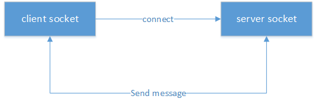
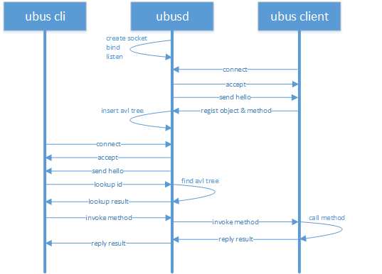

# OpenWrt网络服务
**Jinhua Zhang
v1.0
2017.09.05**
<br>

## 1. preinit

最其实的脚本是/etc/preinit，pi_init_cmd=“/sbin/init”，source /lib/functions.sh /lib/functions/preinit,sh /lib/functions/system.sh，调价了五个hook点，preinit_essential、preinit_main、failsafe、initramfs、preinit_mount_root。
/lib/functions.sh定义了一些config的函数，/lib/functions/preinit.sh定义了一些boot_hook的函数，比如boot_hook_init、boot_hook_add、boot_hook_shift、boot_run_hook

source /lib/preinit/*下面的所以脚本文件，然后boot_run_hook preinit_essential和boot_run_hook preinit_main
第一次进/etc/preinit是，由于没有赋值PREINIT，所以会先去执行/sbin/init
/sbin/init是由procd/init.c编译而来的，，它首先执行一些early cmdline等，最后执行preinit()函数。
preinit函数，配置了环境变量PREINIT，再一次fork了/etc/preinit
进程消失后，调用回调函数spawn_procd，spawn_procd则execp(“procd”)，procd再去执行/etc/init.d/*文件。启动各个服务。

## 2. ubus

ubus是OpenWrt中的进程间通信机制，类似于桌面版linux的dbus，Android的binder。ubus相当于简化版的dbus，ubus基于unix socket实现，socket绑定到一个本地文件，具有较高的效率；

unix socket是C/S模型，建立一个socket连接，server端和client端分别要做如下步骤：
1. 建立一个socket server端，绑定到一个本地socket文件，监听client的连接；
2. 建立一个或多个socket client端，连接到server端；
3. client端和server端相互发送消息；
4. client端或server端收到对方消息后，针对具体消息进行相应处理。

如下图所示：
<center></center>

ubus同样基于这套流程，其中ubusd实现server，其他进程实现client，例如ubus(cli)、netifd、procd；
两个client通信需要通过server转发。

### 2.1. ubusd
ubusd作为ubus的server端，已经由OpenWrt实现好了，不需要做任何修改，下面来分析一下ubusd的工作流程；
1. 通过usock来创建server端socket，且socket bind到文件"/var/run/ubus.sock"，开启listen，等到client的连接；
2. 将socket添加到uloop中poll，触发条件是read，也就是说server socket可读，则触发poll回调server_cb，server_fd的回调函数是server_cb；                                                                                                                                                                                                                                                                                                                                                                                                                                                                                                                                                                                                                                                                                                                                                                                                                                                                                                                                                                                                                                                                                                                                                                                                                                                                                                                                                                                                                                                                                                                                                                                                                                                                                                                                                                                                                                                                                                                                                                                                                                                                                                                                                                                                                                                                                                                                                                                                                                                                                                                                                                                                                                                                                                                                                                                                                                                                                                                                                                                                                                                                                                                                                                                                                                                                                                                                                                                                                                                                                                                                                                                                                                                                                                                                                                                                                                                                                                                                                                                                                                                                                                                                                                                                                                                                                                                                                                                                                                                                                                                                                                                                                                                                                                                                                                                                                                                                                                                                                                                                                                                                                                                                                                                                                                                                                                                                                                
```
static struct uloop_fd server_fd = {
	.cb = server_cb,
};
```
3. server_cb中通过accept来接受client的连接，套接字函数accept执行退出之后会创建一个新的socket，新的socket的fd为accept函数值，而旧的socket不变，也就是accept之后，server端存在两个socket了，旧的socket依然用来listen，新的socket与client建立pair，用于和client的通讯；
4. 根据新的socket的fd(int client_fd)来构建一个ubus_client对象，ubus_client的uloop回调函数是client_cb，将ubus_client插入到avl树中(struct avl_tree clients)，每个向ubusd注册的client都在对应到avl树中的一个ubus_client；
5. ubusd_send_hello，向client端的socket发送一个字符串"hello"；
6. 将ubus_client中的socket fd添加到uloop中去轮询监听，触发条件是read，回调函数是client_cb，也就是client发消息到server，则触发回调client_cb；

client_cb通过write或sendmsg来发消息给client，通过read或recvmsg来接收来自client的消息，ubusd_proto_receive_message根据接收的不同消息类型做不同的处理，如下所示：

| 消息类型                | 处理函数                    |
|:-----------------------|:---------------------------|
| UBUS_MSG_PING          | ubusd_send_pong            |
| UBUS_MSG_ADD_OBJECT    | ubusd_handle_add_object    |
| UBUS_MSG_REMOVE_OBJECT | ubusd_handle_remove_object |
| UBUS_MSG_LOOKUP        | ubusd_handle_lookup        |
| UBUS_MSG_INVOKE        | ubusd_handle_invoke        |
| UBUS_MSG_STATUS        | ubusd_handle_response      |
| UBUS_MSG_DATA          | ubusd_handle_response      |
| UBUS_MSG_SUBSCRIBE     | ubusd_handle_add_watch     |
| UBUS_MSG_UNSUBSCRIBE   | ubusd_handle_remove_watch  |
| UBUS_MSG_NOTIFY        | ubusd_handle_notify        |


### 2.2. ubus cli

OpenWrt为ubus实现了一个cli可执行程序，这个可执行程序的名称是"ubus"，shell script中大部分情况下都是通过ubus命令做跨进程通讯，这个应用场景下，ubus作为client端，发送消息到server端ubusd，ubusd再转发到另一个client端。

ubus支持的commands有list、call、listen、send、wait_for和monitor；
```
static struct {
	const char *name;
	int (*cb)(struct ubus_context *ctx, int argc, char **argv);
} commands[] = {
	{ "list", ubus_cli_list },
	{ "call", ubus_cli_call },
	{ "listen", ubus_cli_listen },
	{ "send", ubus_cli_send },
	{ "wait_for", ubus_cli_wait_for },
	{ "monitor", ubus_cli_monitor },
};
```

- list
命令的使用格式是：
```
ubus [-v] list [path]
```
命令用于列举出系统注册的ubus object和method；
例如：
```
root@OpenWrt:/# ubus list
dhcp
hostapd.wdev0ap0
hostapd.wdev1ap0
log
network
network.device
network.interface
network.interface.lan
network.interface.loopback
network.interface.wan
network.interface.wan6
network.wireless
service
session
system
uci
root@OpenWrt:/# ubus -v list network
'network' @26c90ada
        "restart":{}
        "reload":{}
        "add_host_route":{"target":"String","v6":"Boolean","interface":"String"}
        "get_proto_handlers":{}
        "add_dynamic":{"name":"String"}
```

- call
命令的使用格式是：
```
ubus call path method [message]
```
命令用于执行某个ubus client注册的某个的object的某个method；
例如：
```
root@OpenWrt:/# ubus -v call network.interface.lan status
{
        "up": true,
        "pending": false,
        "available": true,
        "autostart": true,
        "dynamic": false,
        "uptime": 1698,
        "l3_device": "br-lan",
        "proto": "static",
        "device": "br-lan",
        "updated": [
                "addresses"
        ],
        "metric": 0,
        "delegation": true,
        "ipv4-address": [
                {
                        "address": "192.168.1.1",
                        "mask": 24
                }
        ],
        ...
}
```

- listen
命令的使用格式是：
```
ubus listen [path]
```
设置一个监听socket并观察进入的事件；
例如：
```
root@OpenWrt:/# ubus listen &
root@OpenWrt:/# /etc/init.d/network restart
{ "ubus.object.remove": {"id":-369156789,"path":"network.interface.wan6"} }
{ "ubus.object.remove": {"id":10693651,"path":"network.interface.wan"} }
{ "ubus.object.remove": {"id":1946155556,"path":"network.interface.lan"} }
{ "ubus.object.remove": {"id":-696825625,"path":"network.interface.loopback"} }
{ "ubus.object.remove": {"id":-1930323617,"path":"network.interface"} }
{ "ubus.object.remove": {"id":-1647942339,"path":"network.wireless"} }
{ "ubus.object.remove": {"id":-886262541,"path":"network.device"} }
{ "ubus.object.remove": {"id":-1084952745,"path":"network"} }
{ "ubus.object.add": {"id":-22896841,"path":"network"} }
{ "ubus.object.add": {"id":-1554358219,"path":"network.device"} }
{ "ubus.object.add": {"id":-1777113328,"path":"network.wireless"} }
{ "ubus.object.add": {"id":1365477379,"path":"network.interface"} }
{ "ubus.object.add": {"id":1148732338,"path":"network.interface.loopback"} }
{ "ubus.object.add": {"id":1802312926,"path":"network.interface.lan"} }
{ "ubus.object.add": {"id":982976204,"path":"network.interface.wan"} }
{ "ubus.object.add": {"id":-1790820211,"path":"network.interface.wan6"} }
{ "network.interface": {"action":"ifup","interface":"lan"} }
{ "network.interface": {"action":"ifup","interface":"loopback"} }
{ "ubus.object.remove": {"id":-627066478,"path":"hostapd.wdev1ap0"} }
{ "ubus.object.remove": {"id":-208119521,"path":"hostapd.wdev0ap0"} }
{ "ubus.object.add": {"id":154802105,"path":"hostapd.wdev0ap0"} }
{ "ubus.object.add": {"id":-1230601970,"path":"hostapd.wdev1ap0"} }
{ "ubus.object.remove": {"id":-1230601970,"path":"hostapd.wdev1ap0"} }
{ "ubus.object.remove": {"id":154802105,"path":"hostapd.wdev0ap0"} }
{ "ubus.object.add": {"id":914025961,"path":"hostapd.wdev0ap0"} }
{ "ubus.object.add": {"id":488528099,"path":"hostapd.wdev1ap0"} }
```

- send
命令的使用格式是：
```
ubus send type [message]
```
发送一个消息；
例如：
```
root@OpenWrt:/# ubus listen &
root@OpenWrt:/# ubus send network.interface '{"action":"ifup","interface":"lan"}'
{ "network.interface": {"action":"ifup","interface":"lan"} }
```

- wait_for
命令的使用格式是：
```
ubus wait_for object [...]
```
等待某个事件；
例如启动netifd后，/etc/init.d/network会wait_for network_interface这个object的add事件；
```
ubus -t 30 wai_for network.interface
```

- monitor
监听，一般不用

下面以"ubus call"命令为例，来说明ubus client的工作流程。
1. ubus_connect做了三部分工作，a)构造结构体ubus_context，ubux_context表示client端的ubus上下文，包含client注册的object avl tree，client sock，msgbuf；b)创建client unix socket；c)connect to server socket。
2. ubus_lookup_id向ubusd发送消息UBUS_MSG_LOOKUP，查到path对应的object id；ubusd对应的处理函数为ubusd_handle_lookup，ubusd中维护了所有注册过的object的path avl tree，遍历path avl tree进行字符串匹配即可找到对应的object，然后通过ubusd_send_obj将object的UBUS_ATTR_OBJPATH、UBUS_ATTR_OBJID、UBUS_ATTR_OBJTYPE等信息发回给ubus cli，消息类型是UBUS_MSG_DATA。
3. ubus cli端ubus_lookup_id的回调函数是ubus_look_id_cb，所有ubus cli接收到消息后在ubus_lookup_id_cb中解析出来一个id号。
4. ubus_invoke向ubusd发送消息UBUS_MSG_INVOKE，消息中携带了信息UBUS_ATTR_OBJID和UBUS_ATTR_METHOD，ubusd对应UBUS_ATTR_METHOD的处理函数是ubusd_handle_invoke，ubusd根据OBJID找到注册的object，并发UBUS_MSG_INVOKE消息给该client进程，该client进程执行对应的method后，将执行结果发回给ubusd。
5. ubusd将method的执行结果发给ubus cli，ubus cli在回调函数receice_call_result_data将执行结果打印出来。

总体流程如下图所示：
<center></center>

## 3. libubox

### 3.1. json

OpenWrt支持c、shell、lua三种语言的进程通过ubus进行进程间通讯，ubus通讯的消息格式遵循json格式。

json(JavaScript object Notation)是一种轻量级的数据交换格式，易于人读写，也易于机器解析和生成。json是一种独立于编程语言之外的文本格式，兼容多种编程语言，如c、c++、Java、JavaScript、perl、Python等。

json由两种格式组成：
1. string
格式是key:value，value为字符串；
object是一个name/vale对，格式是{name:value}，相当于c语言中的结构体、哈希表等。

2. number
格式是key:value，value为整数；

3. boolean
格式是key:value，value为1或者0；

4. object
object相当于c语言中中的结构体，格式是key:{key1:value1,key2:value2,...}，value可以是string、number、boolean、object或者array；

6. array
array相当于c语言中的数组，格式是key:[value1,value2,...]，value可以是string、number、boolean、object或者array。

OpenWrt shell程序中用到了命令jshn和脚本jshn.sh；
下面是一个shell程序中使用json的例子：
```
. /usr/share/libubox/jshn.sh

# generating json data
json_init
json_add_string "str" "Hello, world!"
json_add_object "obj"
json_add_int "num" "100"
json_add_boolean "bool" "0"
json_close_object
json_add_array "array"
json_add_string "arraystr" "array string"
json_add_int "" "110"
json_add_boolean "" "1"
json_close_array
MSG=`json_dump`
echo ${MSG}

# parsing json data
json_load "$MSG"
json_get_var varstr str
json_select obj
json_get_var varnum num
json_get_var varbool bool
json_select ..
json_select array
json_get_var array1 "1"
json_get_var array2 "2"
json_get_var array3 "3"
cat << EOF
{
  msg : $varstr,
  obj: {
      num : $varnum,
      bool : $varbool },
  array: [ $array1, $array2, $array3 ]
}
```

执行结果为：

```
root@OpenWrt:/# ./jsontest.sh
{ "str": "Hello, world!", "obj": { "num": 100, "bool": false }, "array": [ "array string", 110, true ] }
{
  msg : Hello, world!,
  obj: {
      num : 100,
      bool : 0 },
  array: [ array string, 110, 1 ]
}
```

shell json相关的api函数有：

| 函数                                | 描述                                                    |
|:-----------------------------------|:-------------------------------------------------------|
| json_init<br>json_cleanup          | 初始化json环境<br>清空json环境                           |
| json_add_string                    | 添加string类型的element                                 |
| json_add_int                       | 添加int类型的element                                    |
| json_add_boolean                   | 添加boolean类型的element                                |
| json_add_table<br>json_close_table | 添加table类型的element                                  |
| json_add_array<br>json_close_array | 添加array类型的element                                  |
| json_load                          | 从字符串中导入到json格式                                 |
| json_select                        | 进入到某个element，必须有是table或array才能使用json_select |
| json_get_keys                      | 获取所有element的key                                    |
| json_get_values                    | 获取所有element的value                                  |
| json_get_var                       | 根据key获取value                                        |
| json_get_type                      | 获取element的类型                                       |

### 3.2. blob & blobmsg

```
enum {
        FOO_MESSAGE,
        FOO_LIST,
        FOO_TESTDATA
};

static const struct blobmsg_policy pol[] = {
        [FOO_MESSAGE] = {
                .name = "message",
                .type = BLOBMSG_TYPE_STRING,
        },
        [FOO_LIST] = {
                .name = "list",
                .type = BLOBMSG_TYPE_ARRAY,
        },
        [FOO_TESTDATA] = {
                .name = "testdata",
                .type = BLOBMSG_TYPE_TABLE,
        },
};

static void dump_message(struct blob_buf *buf)
{
        struct blob_attr *tb[ARRAY_SIZE(pol)];

        if (blobmsg_parse(pol, ARRAY_SIZE(pol), tb, blob_data(buf->head), blob_len(buf->head)) != 0) {
                fprintf(stderr, "Parse failed\n");
                return;
        }
        if (tb[FOO_MESSAGE])
                fprintf(stderr, "Message: %s\n", (char *) blobmsg_data(tb[FOO_MESSAGE]));

        if (tb[FOO_LIST]) {
                fprintf(stderr, "List: ");
                dump_table(blobmsg_data(tb[FOO_LIST]), blobmsg_data_len(tb[FOO_LIST]), 0, true);
        }
        if (tb[FOO_TESTDATA]) {
                fprintf(stderr, "Testdata: ");
                dump_table(blobmsg_data(tb[FOO_TESTDATA]), blobmsg_data_len(tb[FOO_TESTDATA]), 0, false);
        }
}

static void fill_message(struct blob_buf *buf)
{
        void *tbl;

        blobmsg_add_string(buf, "message", "Hello, world!");

        tbl = blobmsg_open_table(buf, "testdata");
        blobmsg_add_u32(buf, "hello", 1);
        blobmsg_add_string(buf, "world", "2");
        blobmsg_close_table(buf, tbl);

        tbl = blobmsg_open_array(buf, "list");
        blobmsg_add_u32(buf, NULL, 0);
        blobmsg_add_u32(buf, NULL, 1);
        blobmsg_add_u32(buf, NULL, 2);
        blobmsg_close_table(buf, tbl);
}
```

## 4. procd

procd编译生成两个进程，init和procd；
init进程中包括下面几个阶段：early、cmdline、watchdog_init、kmodloader、preinit；
其中early是early_mounts和early_env，early_mounts挂着文件系统proc、sysfs、cgroup、tmpfs、devpts，初始化设备/dev/null和/dev/console；
cmdline去读取/proc/cmdline，获取debug level；
watchdog_init开启看门狗；
执行kmodloader来加载驱动模块ko，根据/etc/modules-boot.d/下面的内容来加载；
preinit函数中执行/sbin/procd -h /etc/hotplug-preinit.json
设置环境变量PREINIT，执行/etc/preinit；
进入到执行procd了，及时申请一个netlink socket来接收事件；

preinit_proc的cb函数是spawn_procd，即preinit退出后执行spanw_procd
spawn_procd再去执行/sbin/procd

procd有5个状态，分别是STATE_EARLY、STATE_INIT、STATE_RUNNING、STATE_SHUTDOWN、STATE_HALT，这个5个状态按顺序变化，当前状态保存在全局变量state中，可通过procd_state_next()函数使状态变化；

## 5. netifd

netifd_ubus_init首先uloop_init，也是先开启一个loop，然后，ubus_connet连接到ubusd；
ubus_connect
--> ubus_connect_ctx
--> ubus_reconnect
--> usock
--> usock_connect
--> connect(sock, sa, sa_len)
usock对于client会创建一个USOCK_UNIX类型的socket，并且connect去连接path识别的server socket；
netifd_ubus_add_fd
--> ubus_add_uloop
--> uloop_fd_add
uloop_fd_add将ctx->sock添加到loop中，ctx->就是刚刚通过usock创建的Unix socket；
netifd_add_object添加main_object、dev_object、wireless_object；
netifd_add_object会向ubusd注册方法，发送消息UBUS_MSG_ADD_OBJECT；
其中main_object的method有restart、reload、add_host_route、get_prote_handlers、add_dynamic；
dev_object的method有status、set_alias、set_state；
wireless_object的method有up、down、status、notify、get_validate；
’这些method都是执行scripts；
netifd_add_iface_object添加iface_object
iface_object的method有up、down、status、prepare、dump、add_device、remove_device、notify_proto、remove、set_data；
name分别是：
main_object：network
dev_object：network.device
wireless_object：network.wireless
iface_object：network.interface

proto_shell_init：netifd_init_script_handlers(proto_fd, proto_shell_add_handler)
对应到脚本/lib/netifd/proto/*.sh
wireless_init：netifd_init_script_handlers(drv_fd, wireless_add_handler)
对应到脚本/lib/netifd/wireless/*.sh

system_init注册NETLINK_ROUTE、NETLINK_KOBJECT_UEVENT来接收kernel发上来的netlink事件，回调函数分别是cb_rtnl_event和handle_hotplug_event；
config_init_all，做了一堆初始化工作，待分析；