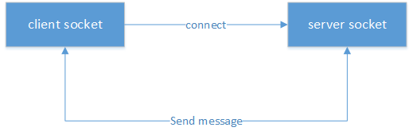
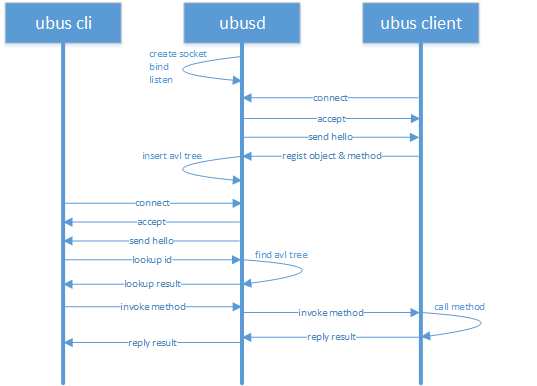
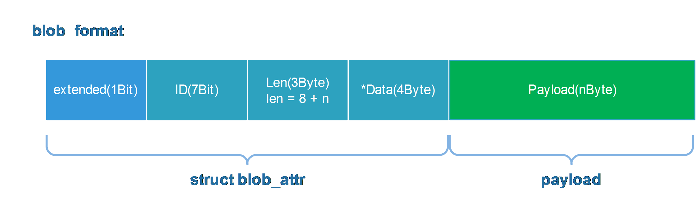
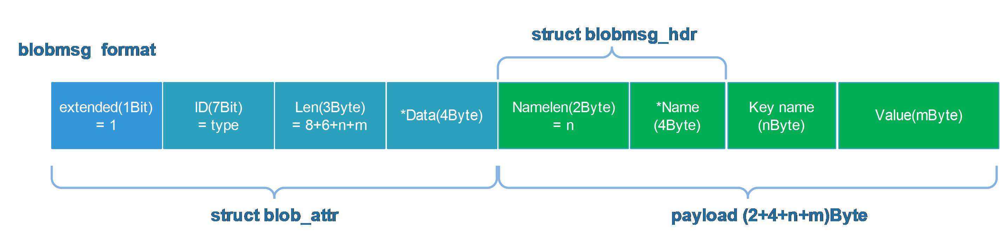
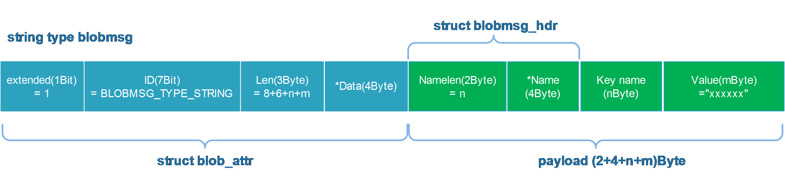
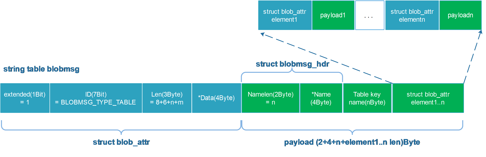
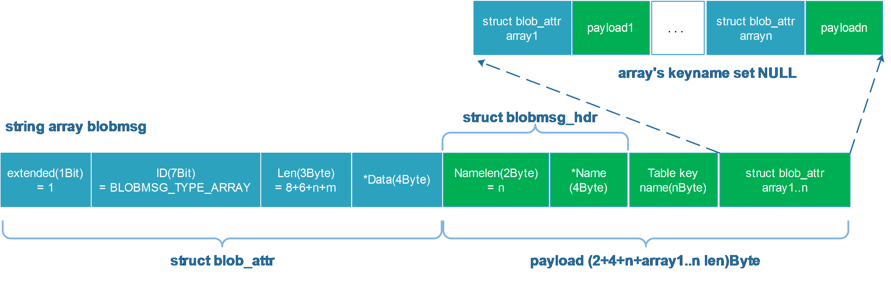
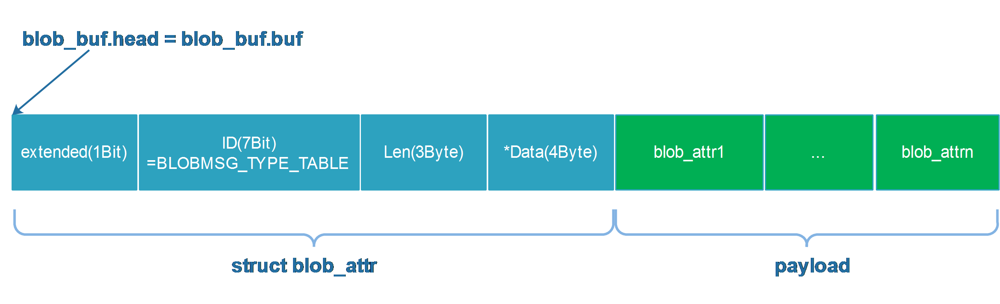

# OpenWrt网络服务
**Jinhua Zhang
v1.0
2017.09.05**
<br>

## 1. init scripts

OpenWrt第一个用户层执行程序为/etc/preinit，这是个脚本程序，


最其实的脚本是/etc/preinit，pi_init_cmd=“/sbin/init”，source /lib/functions.sh /lib/functions/preinit,sh /lib/functions/system.sh，调价了五个hook点，preinit_essential、preinit_main、failsafe、initramfs、preinit_mount_root。
/lib/functions.sh定义了一些config的函数，/lib/functions/preinit.sh定义了一些boot_hook的函数，比如boot_hook_init、boot_hook_add、boot_hook_shift、boot_run_hook

source /lib/preinit/*下面的所以脚本文件，然后boot_run_hook preinit_essential和boot_run_hook preinit_main
第一次进/etc/preinit是，由于没有赋值PREINIT，所以会先去执行/sbin/init
/sbin/init是由procd/init.c编译而来的，，它首先执行一些early cmdline等，最后执行preinit()函数。
preinit函数，配置了环境变量PREINIT，再一次fork了/etc/preinit
进程消失后，调用回调函数spawn_procd，spawn_procd则execp(“procd”)，procd再去执行/etc/init.d/*文件。启动各个服务。

*** ---待补充--- ***

## 2. ubus

ubus是OpenWrt中的进程间通信机制，类似于桌面版linux的dbus，Android的binder。ubus相当于简化版的dbus，ubus基于unix socket实现，socket绑定到一个本地文件，具有较高的效率；

unix socket是C/S模型，建立一个socket连接，server端和client端分别要做如下步骤：
1. 建立一个socket server端，绑定到一个本地socket文件，监听client的连接；
2. 建立一个或多个socket client端，连接到server端；
3. client端和server端相互发送消息；
4. client端或server端收到对方消息后，针对具体消息进行相应处理。

如下图所示：
<center></center>

ubus同样基于这套流程，其中ubusd实现server，其他进程实现client，例如ubus(cli)、netifd、procd；
两个client通信需要通过server转发。

### 2.1. ubusd
ubusd作为ubus的server端，已经由OpenWrt实现好了，不需要做任何修改，下面来分析一下ubusd的工作流程；
1. 通过usock来创建server端socket，且socket bind到文件"/var/run/ubus.sock"，开启listen，等到client的连接；
2. 将socket添加到uloop中poll，触发条件是read，也就是说server socket可读，则触发poll回调server_cb，server_fd的回调函数是server_cb；                                                                                                                                                                                                                                                                                                                                                                                                                                                                                                                                                                                                                                                                                                                                                                                                                                                                                                                                                                                                                                                                                                                                                                                                                                                                                                                                                                                                                                                                                                                                                                                                                                                                                                                                                                                                                                                                                                                                                                                                                                                                                                                                                                                                                                                                                                                                                                                                                                                                                                                                                                                                                                                                                                                                                                                                                                                                                                                                                                                                                                                                                                                                                                                                                                                                                                                                                                                                                                                                                                                                                                                                                                                                                                                                                                                                                                                                                                                                                                                                                                                                                                                                                                                                                                                                                                                                                                                                                                                                                                                                                                                                                                                                                                                                                                                                                                                                                                                                                                                                                                                                                                                                                                                                                                                                                                                                                                
```
static struct uloop_fd server_fd = {
	.cb = server_cb,
};
```
3. server_cb中通过accept来接受client的连接，套接字函数accept执行退出之后会创建一个新的socket，新的socket的fd为accept函数值，而旧的socket不变，也就是accept之后，server端存在两个socket了，旧的socket依然用来listen，新的socket与client建立pair，用于和client的通讯；
4. 根据新的socket的fd(int client_fd)来构建一个ubus_client对象，ubus_client的uloop回调函数是client_cb，将ubus_client插入到avl树中(struct avl_tree clients)，每个向ubusd注册的client都在对应到avl树中的一个ubus_client；
5. ubusd_send_hello，向client端的socket发送一个字符串"hello"；
6. 将ubus_client中的socket fd添加到uloop中去轮询监听，触发条件是read，回调函数是client_cb，也就是client发消息到server，则触发回调client_cb；

client_cb通过write或sendmsg来发消息给client，通过read或recvmsg来接收来自client的消息，ubusd_proto_receive_message根据接收的不同消息类型做不同的处理，如下所示：

| 消息类型                | 处理函数                    |
|:-----------------------|:---------------------------|
| UBUS_MSG_PING          | ubusd_send_pong            |
| UBUS_MSG_ADD_OBJECT    | ubusd_handle_add_object    |
| UBUS_MSG_REMOVE_OBJECT | ubusd_handle_remove_object |
| UBUS_MSG_LOOKUP        | ubusd_handle_lookup        |
| UBUS_MSG_INVOKE        | ubusd_handle_invoke        |
| UBUS_MSG_STATUS        | ubusd_handle_response      |
| UBUS_MSG_DATA          | ubusd_handle_response      |
| UBUS_MSG_SUBSCRIBE     | ubusd_handle_add_watch     |
| UBUS_MSG_UNSUBSCRIBE   | ubusd_handle_remove_watch  |
| UBUS_MSG_NOTIFY        | ubusd_handle_notify        |


### 2.2. ubus cli

OpenWrt为ubus实现了一个cli可执行程序，这个可执行程序的名称是"ubus"，shell script中大部分情况下都是通过ubus命令做跨进程通讯，这个应用场景下，ubus作为client端，发送消息到server端ubusd，ubusd再转发到另一个client端。

ubus支持的commands有list、call、listen、send、wait_for和monitor；
```
static struct {
	const char *name;
	int (*cb)(struct ubus_context *ctx, int argc, char **argv);
} commands[] = {
	{ "list", ubus_cli_list },
	{ "call", ubus_cli_call },
	{ "listen", ubus_cli_listen },
	{ "send", ubus_cli_send },
	{ "wait_for", ubus_cli_wait_for },
	{ "monitor", ubus_cli_monitor },
};
```

- list
命令的使用格式是：
```
ubus [-v] list [path]
```
命令用于列举出系统注册的ubus object和method；
例如：
```
root@OpenWrt:/# ubus list
dhcp
hostapd.wdev0ap0
hostapd.wdev1ap0
log
network
network.device
network.interface
network.interface.lan
network.interface.loopback
network.interface.wan
network.interface.wan6
network.wireless
service
session
system
uci
root@OpenWrt:/# ubus -v list network
'network' @26c90ada
        "restart":{}
        "reload":{}
        "add_host_route":{"target":"String","v6":"Boolean","interface":"String"}
        "get_proto_handlers":{}
        "add_dynamic":{"name":"String"}
```

- call
命令的使用格式是：
```
ubus call path method [message]
```
命令用于执行某个ubus client注册的某个的object的某个method；
例如：
```
root@OpenWrt:/# ubus -v call network.interface.lan status
{
        "up": true,
        "pending": false,
        "available": true,
        "autostart": true,
        "dynamic": false,
        "uptime": 1698,
        "l3_device": "br-lan",
        "proto": "static",
        "device": "br-lan",
        "updated": [
                "addresses"
        ],
        "metric": 0,
        "delegation": true,
        "ipv4-address": [
                {
                        "address": "192.168.1.1",
                        "mask": 24
                }
        ],
        ...
}
```

- listen
命令的使用格式是：
```
ubus listen [path]
```
设置一个监听socket并观察进入的事件；
例如：
```
root@OpenWrt:/# ubus listen &
root@OpenWrt:/# /etc/init.d/network restart
{ "ubus.object.remove": {"id":-369156789,"path":"network.interface.wan6"} }
{ "ubus.object.remove": {"id":10693651,"path":"network.interface.wan"} }
{ "ubus.object.remove": {"id":1946155556,"path":"network.interface.lan"} }
{ "ubus.object.remove": {"id":-696825625,"path":"network.interface.loopback"} }
{ "ubus.object.remove": {"id":-1930323617,"path":"network.interface"} }
{ "ubus.object.remove": {"id":-1647942339,"path":"network.wireless"} }
{ "ubus.object.remove": {"id":-886262541,"path":"network.device"} }
{ "ubus.object.remove": {"id":-1084952745,"path":"network"} }
{ "ubus.object.add": {"id":-22896841,"path":"network"} }
{ "ubus.object.add": {"id":-1554358219,"path":"network.device"} }
{ "ubus.object.add": {"id":-1777113328,"path":"network.wireless"} }
{ "ubus.object.add": {"id":1365477379,"path":"network.interface"} }
{ "ubus.object.add": {"id":1148732338,"path":"network.interface.loopback"} }
{ "ubus.object.add": {"id":1802312926,"path":"network.interface.lan"} }
{ "ubus.object.add": {"id":982976204,"path":"network.interface.wan"} }
{ "ubus.object.add": {"id":-1790820211,"path":"network.interface.wan6"} }
{ "network.interface": {"action":"ifup","interface":"lan"} }
{ "network.interface": {"action":"ifup","interface":"loopback"} }
{ "ubus.object.remove": {"id":-627066478,"path":"hostapd.wdev1ap0"} }
{ "ubus.object.remove": {"id":-208119521,"path":"hostapd.wdev0ap0"} }
{ "ubus.object.add": {"id":154802105,"path":"hostapd.wdev0ap0"} }
{ "ubus.object.add": {"id":-1230601970,"path":"hostapd.wdev1ap0"} }
{ "ubus.object.remove": {"id":-1230601970,"path":"hostapd.wdev1ap0"} }
{ "ubus.object.remove": {"id":154802105,"path":"hostapd.wdev0ap0"} }
{ "ubus.object.add": {"id":914025961,"path":"hostapd.wdev0ap0"} }
{ "ubus.object.add": {"id":488528099,"path":"hostapd.wdev1ap0"} }
```

- send
命令的使用格式是：
```
ubus send type [message]
```
发送一个消息；
例如：
```
root@OpenWrt:/# ubus listen &
root@OpenWrt:/# ubus send network.interface '{"action":"ifup","interface":"lan"}'
{ "network.interface": {"action":"ifup","interface":"lan"} }
```

- wait_for
命令的使用格式是：
```
ubus wait_for object [...]
```
等待某个事件；
例如启动netifd后，/etc/init.d/network会wait_for network_interface这个object的add事件；
```
ubus -t 30 wai_for network.interface
```

- monitor
监听，一般不用

下面以"ubus call"命令为例，来说明ubus client的工作流程。
1. ubus_connect做了三部分工作，a)构造结构体ubus_context，ubux_context表示client端的ubus上下文，包含client注册的object avl tree，client sock，msgbuf；b)创建client unix socket；c)connect to server socket。
2. ubus_lookup_id向ubusd发送消息UBUS_MSG_LOOKUP，查到path对应的object id；ubusd对应的处理函数为ubusd_handle_lookup，ubusd中维护了所有注册过的object的path avl tree，遍历path avl tree进行字符串匹配即可找到对应的object，然后通过ubusd_send_obj将object的UBUS_ATTR_OBJPATH、UBUS_ATTR_OBJID、UBUS_ATTR_OBJTYPE等信息发回给ubus cli，消息类型是UBUS_MSG_DATA。
3. ubus cli端ubus_lookup_id的回调函数是ubus_look_id_cb，所有ubus cli接收到消息后在ubus_lookup_id_cb中解析出来一个id号。
4. ubus_invoke向ubusd发送消息UBUS_MSG_INVOKE，消息中携带了信息UBUS_ATTR_OBJID和UBUS_ATTR_METHOD，ubusd对应UBUS_ATTR_METHOD的处理函数是ubusd_handle_invoke，ubusd根据OBJID找到注册的object，并发UBUS_MSG_INVOKE消息给该client进程，该client进程执行对应的method后，将执行结果发回给ubusd。
5. ubusd将method的执行结果发给ubus cli，ubus cli在回调函数receice_call_result_data将执行结果打印出来。

总体流程如下图所示：
<center></center>

## 3. libubox

### 3.1. json

OpenWrt支持c、shell、lua三种语言的进程通过ubus进行进程间通讯，ubus通讯的消息格式遵循json格式。

json(JavaScript object Notation)是一种轻量级的数据交换格式，易于人读写，也易于机器解析和生成。json是一种独立于编程语言之外的文本格式，兼容多种编程语言，如c、c++、Java、JavaScript、perl、Python等。

json由两种格式组成：
1. string
格式是key:value，value为字符串；
object是一个name/vale对，格式是{name:value}，相当于c语言中的结构体、哈希表等。

2. number
格式是key:value，value为整数；

3. boolean
格式是key:value，value为1或者0；

4. object
object相当于c语言中中的结构体，格式是key:{key1:value1,key2:value2,...}，value可以是string、number、boolean、object或者array；

6. array
array相当于c语言中的数组，格式是key:[value1,value2,...]，value可以是string、number、boolean、object或者array。

OpenWrt shell程序中用到了命令jshn和脚本jshn.sh；
下面是一个shell程序中使用json的例子：
```
. /usr/share/libubox/jshn.sh

# generating json data
json_init
json_add_string "str" "Hello, world!"
json_add_object "obj"
json_add_int "num" "100"
json_add_boolean "bool" "0"
json_close_object
json_add_array "array"
json_add_string "arraystr" "array string"
json_add_int "" "110"
json_add_boolean "" "1"
json_close_array
MSG=`json_dump`
echo ${MSG}

# parsing json data
json_load "$MSG"
json_get_var varstr str
json_select obj
json_get_var varnum num
json_get_var varbool bool
json_select ..
json_select array
json_get_var array1 "1"
json_get_var array2 "2"
json_get_var array3 "3"
cat << EOF
{
  msg : $varstr,
  obj: {
      num : $varnum,
      bool : $varbool },
  array: [ $array1, $array2, $array3 ]
}
```

执行结果为：

```
root@OpenWrt:/# ./jsontest.sh
{ "str": "Hello, world!", "obj": { "num": 100, "bool": false }, "array": [ "array string", 110, true ] }
{
  msg : Hello, world!,
  obj: {
      num : 100,
      bool : 0 },
  array: [ array string, 110, 1 ]
}
```

shell json相关的api函数有：

| 函数                                | 描述                                                    |
|:-----------------------------------|:-------------------------------------------------------|
| json_init<br>json_cleanup          | 初始化json环境<br>清空json环境                           |
| json_add_string                    | 添加string类型的element                                 |
| json_add_int                       | 添加int类型的element                                    |
| json_add_boolean                   | 添加boolean类型的element                                |
| json_add_table<br>json_close_table | 添加table类型的element                                  |
| json_add_array<br>json_close_array | 添加array类型的element                                  |
| json_load                          | 从字符串中导入到json格式                                 |
| json_select                        | 进入到某个element，必须有是table或array才能使用json_select |
| json_get_keys                      | 获取所有element的key                                    |
| json_get_values                    | 获取所有element的value                                  |
| json_get_var                       | 根据key获取value                                        |
| json_get_type                      | 获取element的类型                                       |

### 3.2. blob & blobmsg

ubus之间传递的消息在程序中使用blob或者blobmsg的形式组织，blob是一种二进制字节序列，在libubox中，blob使用结构体struct blob_attr表示，如下所示：
```
struct blob_attr {
	uint32_t id_len;
	char data[];
};
```

在内存中，一个blob数据的格式如下所示：


blob是符合TLV格式的，TLV表示Type-Length-Value，上图中，ID即使Type，Len即是Length，Payload即是Value。

blobmsg是在blob的基础上扩展出来的，blobmsg的格式如下图所示：


blobmsg中扩展标准位extended等于1，payload拆分出key和value两个字段，ID表示blogmsg的类型，类型包括BLOBMSG_TYPE_STRING、BLOBMSG_TYPE_INT、BLOBMSG_TYPE_BOOL、BLOBMSG_TYPE_TABLE、BLOBMSG_TYPE_ARRAY。

- string、int、bool类型blobmsg
类似于json，string类型的blobmsg的格式如下：

string类型的blobmsg的value为string，int和bool类型的blobmsg的value为对应类型的值。

- table、array类型blobmsg
类似于json，table类型的blobmsg相当于object类型的json，相当于c语言中的结构体，array相当于c语言中的数组；
table类型的blobmsg格式如下图所示：

array类型的blobmsg格式如下图所示：

array和table十分相似，区别在于array的元素是不需要key名字的。

一般使用结构体blob_buf来表示blobmsg链表，blob_buf的head和buf（之所以要用两个指针是因为在加到blobmsg长度时，重新申请连续内存指针会发生改变）都指向一个table类型的blobmsg，buflen等于总长度；
格式如下所示：


blob或者blobmsg常用的api如下所示：
1. string
blobmsg_add_string
blobmsg_get_string

2. int
blobmsg_add_u8
blobmsg_add_u16
blobmsg_add_u32
blobmsg_add_u64
blobmsg_get_u8
blobmsg_get_u16
blobmsg_get_u32
blobmsg_get_u64

3. bool
bool转换成u8的0或者1

4. table
blobmsg_open_table
blobmsg_close_table
```
/*
 * Example:
 *
 * table_key : {
 *     string_key : "this is a string",
 *     int_key : 100,
 *     bool_key : true
 */}
static struct blob_buf buf;
blobmsg_buf_init(&buf);
void *tbl = blobmsg_open_table(buf, "table_key");
blobmsg_add_string(buf, "string_key", "this is a string");
blobmsg_add_u8(buf, "int_key", 100);
blobmsg_add_u8(buf, "bool_key", 1);
blobmsg_close_table(buf, tbl);
```

5. array
blobmsg_open_array
blobmsg_close_array
```
/*
 * Example:
 *
 * array_key : [ "this is a string", 100, true ]
 */
static struct blob_buf buf;
blobmsg_buf_init(&buf);
void *array = blobmsg_open_array(buf, "array_key");
blobmsg_add_string(buf, NULL, "this is a string");
blobmsg_add_u8(buf, NULL, 100);
blobmsg_add_u8(buf, NULL, 1);
blobmsg_close_array(buf, array);
```

6. parse
blobmsg_parse
```
//上面两个例子中添加table和array到buf中去，下面将其取出来
enum {
        FOO_TABLE,
        FOO_ARRAY
};
static const struct blobmsg_policy pol[] = {
        [FOO_TABLE] = {
                .name = "table_key",
                .type = BLOBMSG_TYPE_TABLE,
        },
        [FOO_ARRAY] = {
                .name = "array_key",
                .type = BLOBMSG_TYPE_ARRAY,
        },
};
struct blob_attr *tb[ARRAY_SIZE(pol)];
blobmsg_parse(pol, ARRAY_SIZE(pol), tb, blob_data(buf->head); //parse
/* after parse
 * tb[FOO_TABLE] is table blobmsg
 * tb[FOO_ARRAY] is array blobmsg
 * blobmsg_data(tb[FOO_TABLE] get table element head
 * __blob_for_each_attr(attr, head, len) get every element
 * /
```

## 4. procd

procd编译生成两个进程，init和procd；
init进程中包括下面几个阶段：early、cmdline、watchdog_init、kmodloader、preinit；
其中early是early_mounts和early_env，early_mounts挂着文件系统proc、sysfs、cgroup、tmpfs、devpts，初始化设备/dev/null和/dev/console；
cmdline去读取/proc/cmdline，获取debug level；
watchdog_init开启看门狗；
执行kmodloader来加载驱动模块ko，根据/etc/modules-boot.d/下面的内容来加载；
preinit函数中执行/sbin/procd -h /etc/hotplug-preinit.json
设置环境变量PREINIT，执行/etc/preinit；
进入到执行procd了，及时申请一个netlink socket来接收事件；

preinit_proc的cb函数是spawn_procd，即preinit退出后执行spanw_procd
spawn_procd再去执行/sbin/procd

procd有5个状态，分别是STATE_EARLY、STATE_INIT、STATE_RUNNING、STATE_SHUTDOWN、STATE_HALT，这个5个状态按顺序变化，当前状态保存在全局变量state中，可通过procd_state_next()函数使状态变化；

*** ---待补充--- ***

## 5. netifd

### 5.1 regist ubus method

首先，netifd初始化时会向ubusd支持一系列的object & method，在netifd_ubus_init中添加object：main_object, dev_object, wireless_object, iface_object；脚本（例如ifup、devstatus等）通过ubus call来执行netifd的method。

- main_object
object name为"network"，method列表如下：

| name               | handler                   |
|--------------------|---------------------------|
| restart            | netifd_handle_restart     |
| reload             | netifd_handle_reload      |
| add_host_route     | netifd_add_host_route     |
| get_proto_handlers | netifd_get_proto_handlers |
| add_dynamic        | netifd_add_dynamic        |
```
root@OpenWrt:/# ubus -v list network
'network' @90c358a9
        "restart":{}
        "reload":{}
        "add_host_route":{"target":"String","v6":"Boolean","interface":"String"}
        "get_proto_handlers":{}
        "add_dynamic":{"name":"String"}
```

- dev_object
object name为"network.device"，method列表如下：

| name      | handler                 |
|-----------|-------------------------|
| status    | netifd_dev_status       |
| set_alias | netifd_handle_alias     |
| set_state | netifd_handle_set_state |
```
root@OpenWrt:/# ubus -v list network.device
'network.device' @9fa99d73
        "status":{"name":"String"}
        "set_alias":{"alias":"Array","device":"String"}
        "set_state":{"name":"String","defer":"Boolean"}
```

- wireless_object
object name为"network.wireless"，method列表如下：

| name         | handler                         |
|--------------|---------------------------------|
| up           | netifd_handle_wdev_up           |
| down         | netifd_handle_wdev_down         |
| status       | netifd_handle_wdev_status       |
| notify       | netifd_handle_wdev_notify       |
| get_validate | netifd_handle_wdev_get_validate |
```
root@OpenWrt:/# ubus -v list network.wireless
'network.wireless' @4cb96ce9
        "up":{}
        "down":{}
        "status":{}
        "notify":{}
        "get_validate":{}
```

- iface_object
object name为"network.interface"，method列表如下：

| name          | handler                     |
|---------------|-----------------------------|
| up            | netifd_handle_up            |
| down          | netifd_handle_down          |
| status        | netifd_handle_status        |
| prepare       | netifd_handle_iface_prepare |
| dump          | netifd_handle_dump          |
| add_device    | netifd_iface_handle_device  |
| remove_device | netifd_iface_handle_device  |
| notify_proto  | netifd_iface_notify_proto   |
| remove        | netifd_iface_remove         |
| set_data      | netifd_handle_set_data      |
```
root@OpenWrt:/# ubus -v list network.interface
'network.interface' @1193bd55
        "up":{}
        "down":{}
        "status":{}
        "prepare":{}
        "dump":{}
        "add_device":{"name":"String","link-ext":"Boolean"}
        "remove_device":{"name":"String","link-ext":"Boolean"}
        "notify_proto":{}
        "remove":{}
        "set_data":{}
```

### 5.2 add proto

proto是interface获取IP配置的方式，包括static、DHCP、DHCPv6、PPPoE等，其中static(proto_static)是在代码中定义的，而DHCP、PPPoE定义在shell scripts上(proto_shell)，scripts位于/lib/netifd/proto/目录下。

- static proto
```
static struct proto_handler static_proto = {
	.name = "static",
	.flags = PROTO_FLAG_IMMEDIATE |
		 PROTO_FLAG_FORCE_LINK_DEFAULT,
	.config_params = &proto_ip_attr,
	.attach = static_attach,
};
```
config_params包括ipaddr、ip6addr、netmask、broadcast、gateway、ip6gw、ip6prefix；
如果一个interface需要使用到该proto，则会使用它的attach方法
- shell proto
proto_shell_init会进到/lib/netifd/proto/目录下解析*.sh，以dhcp.sh为例，popen执行命令"/bin/sh -c dhcp.sh '' dump"，执行结果是一个json格式的字符串：
```
./dhcp.sh '' dump
{ "name": "dhcp", "config": [ [ "ipaddr:ipaddr", 3 ], [ "hostname:hostname", 3 ]
, [ "clientid", 3 ], [ "vendorid", 3 ], [ "broadcast:bool", 7 ], [ "reqopts:list
(string)", 3 ], [ "iface6rd", 3 ], [ "sendopts", 3 ], [ "delegate", 7 ], [ "zone
6rd", 3 ], [ "zone", 3 ], [ "mtu6rd", 3 ], [ "customroutes", 3 ] ], "no-device":
 false, "no-proto-task": false, "available": false, "renew-handler": true, "last
error": false }
```
分析一下执行脚本命令"dhcp.sh '' dump"做了哪些事情，进到dhcp.sh，首先执行函数init_proto "$@"，init_proto定义在netifd-proto.sh中，init_proto函数中，cmd=dump，也就是定义了函数add_protocol；
```
add_protocol() {
        no_device=0
        no_proto_task=0
        available=0
        renew_handler=0

        add_default_handler "proto_$1_init_config"

        json_init
        json_add_string "name" "$1"
        json_add_array "config"
        eval "proto_$1_init_config"
        json_close_array
        json_add_boolean no-device "$no_device"
        json_add_boolean no-proto-task "$no_proto_task"
        json_add_boolean available "$available"
        json_add_boolean renew-handler "$renew_handler"
        json_add_boolean lasterror "$lasterror"
        json_dump
}
```
回到dhcp.sh，文件的最后会执行函数add_protocol dhcp，实际上就是装置一个json结构的字符串，包括key：name、config、no-device、no-proto-task、available、renew-handler和lasterror；config为array类型，在proto_dhcp_init_config中组装，proto_dhcp_init_config函数定义在dhcp.sh中，向config添加成员ipaddr:ipaddr、hostname:hostname、clientid、vendorid、broadcast:bool、reqopts:list(string)、iface6rd、sendopts、delegate、zone6rd、zone、mtu6rd、customroutes，这些及时DHCP需要的参数。
proto_shell_add_handler中封装一个proto_handle *proto：
```
proto->name = "dhcp"
proto->attach = proto_shell_attach
proto->flags //依赖于dump中no-device、no-proto-task、available、renew-handler和lasterror
proto->config_params //从dump中的config导入，包括ipaddr、hostname、clientid、vendorid、broadcast、reqopts、iface6rd、sendopts、delegate、zone6rd、zone、mtu6rd、customroutes
```
最后通过add_proto_handler将proto添加到全局avl tree中，也就是句柄handlers中。

### 5.3. init device & interface

netifd中的device代表物理设备，例如eth0；
如果需要管理device的状态，则注册一个device_user，device_user绑定到对于的device上，而且包含device event事件的回调函数，如果device的device_user计数为0，则device结构体会被自动释放掉；
bridge或vlan是特殊的device，它们可以引用其他device；
device的up/down状态由device_user计数决定，claim_device增加device_user计数，则bring up，release_device减少device_user计数，当计数减为0时，则bring down；

netifd中的interface代表应用在一个或多个device上的配置；
interface必须绑定一个main device和一个l3 device，如果使用static或者dhcp proto时，interface的l3 device指向main device；如果使用pppoe，则l3 device指向ppp0；

config_init_all会调用config_init_devices、config_init_interfaces、config_init_routes、config_init_rules、config_init_globals、config_init_wireless来创建device、interface、wireless等；
其中device、interface、route、rules、globals由/etc/config/network的配置参数来生成，wireless由/etc/config/wireles的配置参数来生成。

/etc/config/network的内容如下：
```
config interface 'lan'
        option type 'bridge'
        option ifname 'eth0 eth1'
        option proto 'static'
        option ipaddr '192.168.1.1'
        option netmask '255.255.255.0'
        option ip6assign '60'

config interface 'wan'
        option ifname 'eth2'
        option proto 'dhcp'
```
上面定义了两个section，type都是interface，可见没有创建device，所以只看config_init_interfaces这个函数；

config_parse_interface会先判断有没有option disabled 1，如果有，则直接return，否则创建interface并添加到全局avl tree（interfaces）中，如果有option type 'bridge'，则使用config_parse_bridge_interface创建devices，再使用interface_alloc创建interface；

上面的config中interface lan是bridge，interface wan为普通interface，下面先看看config_parse_bridge_interface；
interface name是lan，则会创建一个name是br-lan的device，device_type为bridge_device_type；
```
const struct device_type bridge_device_type = {
	.name = "Bridge",
	.config_params = &bridge_attr_list,

	.create = bridge_create,
	.config_init = bridge_config_init,
	.reload = bridge_reload,
	.free = bridge_free,
	.dump_info = bridge_dump_info,
};
```
先调用type->create，也就是bridge_create，再调用type->config_init，也就是bridge_config_init；

进到bridge_create，调用链如下所示：
```
bridge_create
	--> device_init
		--> device_init_virtual
			--> 
```
最后设置device的set_state方法是bridge_set_state，将device添加到全局avl tree(devices)中去；

再看bridge_config_init，bridge_add_member根据config中的ifname添加member，ifname包括eth0和eth1，device_get(name, true)会先从avl tree devices中查找，如果没有查找到则创建，初始化时并没有eth0和eth1 device，在device_get会创建这两个device，device_type为simple_device_type；

添加member到bridge_state的vlist_tree members后，会执行vlist的update函数，即bridge_member_update；bridge_member_update中会给之前创建的eth0/eth1 device添加device_user，bridge_member作为bridge device的device_user，在bridge_member结构体中会有一个成员struct device_user dev，bm->dev.cb = bridge_member_cb；bridge_enable_member中device_claim将eth0/eth1 bring up，system_bridge_addif桥接到br-lan上；

 interface_alloc申请interface，将interface添加到全局avl list interfaces中，执行avl_list update回调函数，interface_update，interface_update做了三件事：
1. proto_init_interface
interface attach到proto
2. interface_claim_device
interface绑定main device和l3 device；
3. netifd_ubus_add_interface
注册ubus object network.interface.xxx，method：up、down、status、prepare、dump、add_device、remove_device、notify_proto、remove、set_data.